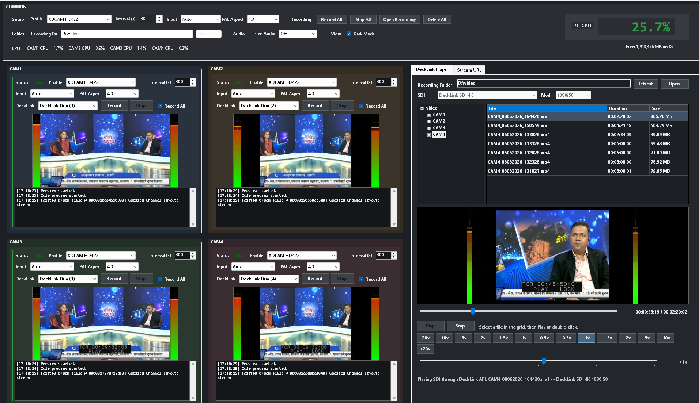

# FfmpegRecorder



Windows x64 WinForms recorder and DeckLink playout tool.

The application is built for a fixed `1920x1080` operator screen. It records DeckLink and stream sources, previews video with audio meters, and plays files back through local preview and optional DeckLink SDI output.

## Current Architecture

- FFmpeg binaries are used for recording, decoding, preview frame extraction, audio monitoring, and probing.
- DeckLink Player SDI output is handled in-process through the Blackmagic DeckLink SDK.
- `DeckLinkAPI.Interop.dll` is referenced from `DeckLinkSdk\DeckLinkAPI.Interop.dll`.
- There is no separate `DeckLinkOutputHelper.exe`.
- There is no `decklinkplayer.exe`.
- The build target removes stale helper/player artifacts if they exist in the output folder.

## Main Features

- Four DeckLink recorder panels: `CAM1`, `CAM2`, `CAM3`, and `CAM4`.
- Stream recorder for direct URLs, local files, YouTube URLs, and Facebook / `fb.watch` URLs.
- Live preview with left/right audio meters.
- `Record All`, `Stop All`, individual record/stop, and per-recorder enable controls.
- Recording mode selector for indefinite `Single File` recording or timed `Interval Files` recording.
- Persistent settings for sources, profiles, intervals, input modes, PAL aspect, audio listen, player output, and recording folder.
- One folder per recorder under the selected recording root.
- DeckLink Player tab with folder tree, file grid, preview, audio meters, scrubber, transport controls, speed controls, and SDI output selection.
- Timestamped executable generated after each build.

## Requirements

- Windows x64.
- .NET 10 Windows Desktop SDK/runtime.
- Blackmagic Desktop Video drivers.
- Blackmagic DeckLink hardware for SDI input/output.
- Local FFmpeg tools beside the built app:

```text
ffmpeg.exe
ffplay.exe
ffprobe.exe
```

Optional tools beside the built app:

```text
ffmbc.exe or ffmbc-*.exe
yt-dlp.exe
```

Use `ffmbc` for the Sony-compatible MXF profile. Use `yt-dlp.exe` for YouTube/Facebook page URLs.

## Important Folders

```text
DeckLinkSdk\
```

Contains the Blackmagic SDK interop DLL used by in-process DeckLink output:

```text
DeckLinkSdk\DeckLinkAPI.Interop.dll
```

```text
bin\Debug\net10.0-windows\
```

Normal debug output folder. After a successful build, the app creates a timestamped executable such as:

```text
FfmpegRecorder_20260608_171805.exe
```

```text
obj\
```

Normal MSBuild intermediate folder. It does not need to be deleted for normal builds.

## Build

```powershell
dotnet build .\FfmpegRecorder.vbproj
```

The build:

- Builds the main WinForms app.
- Copies `DeckLinkAPI.Interop.dll` to the output folder.
- Removes old timestamped `FfmpegRecorder_*.exe` files.
- Removes stale helper/player artifacts such as `DeckLinkOutputHelper.exe` or `decklinkplayer*.exe` if they exist.
- Renames the main executable to a fresh timestamped executable.

Expected output:

```text
bin\Debug\net10.0-windows\FfmpegRecorder_yyyyMMdd_HHmmss.exe
```

## Run

Open the latest timestamped executable:

```text
bin\Debug\net10.0-windows\FfmpegRecorder_yyyyMMdd_HHmmss.exe
```

Expected runtime files in the same folder:

```text
FfmpegRecorder.dll
FfmpegRecorder.deps.json
FfmpegRecorder.runtimeconfig.json
DeckLinkAPI.Interop.dll
ffmpeg.exe
ffplay.exe
ffprobe.exe
```

Optional runtime files:

```text
ffmbc-0.7.4-x64.exe
yt-dlp.exe
```

## DeckLink Inputs

Default preferred input mapping:

| Camera | Preferred input |
| --- | --- |
| `CAM1` | `DeckLink SDI 4K` |
| `CAM2` | `DeckLink Duo (1)` |
| `CAM3` | `DeckLink Duo (2)` |
| `CAM4` | `DeckLink Duo (3)` |

Each camera can also be set to `None`. Use `None` when a card is unavailable or when you want to free a device.

If two camera panels try to use the same DeckLink source, the app avoids silently duplicating the source and swaps/updates assignments where possible.

## Input Modes And PAL

Default input mode:

```text
Auto
```

Available modes:

| Mode | Use |
| --- | --- |
| `Auto` | Let FFmpeg/DeckLink detect the input where supported. |
| `1080i50` | Standard HD interlaced workflow. |
| `PAL` | Force SD PAL input handling. |

PAL aspect options:

| PAL Aspect | Result |
| --- | --- |
| `4:3` | Upconverts PAL 4:3 to `1920x1080` with correct geometry/pillarbox. |
| `16:9` | Upconverts anamorphic PAL widescreen to full-frame `1920x1080`. |

## Recording Profiles

| Profile | Extension | Notes |
| --- | --- | --- |
| `XDCAM HD422` | `.mxf` | MPEG-2 4:2:2 MXF. |
| `XDCAM Sony Compatible` | `.mxf` | Uses FFmbc finalization for Sony-friendly MXF. |
| `MP4 High Quality` | `.mp4` | H.264 high-quality file. |
| `MP4 Low Bitrate` | `.mp4` | Smaller H.264 file. |
| `ProRes Proxy (Small)` | `.mov` | Lightweight ProRes proxy. |
| `ProRes LT (Light)` | `.mov` | ProRes LT. |
| `ProRes 422 (Medium)` | `.mov` | Standard ProRes 422. |
| `ProRes 422 HQ (High)` | `.mov` | ProRes 422 HQ. |

For PAL input, the app can upconvert to HD before recording according to the selected PAL aspect.

## Recording Modes

Use `Mode` to choose how recordings are written:

| Mode | Result |
| --- | --- |
| `Single File` | Records one timestamped file until you press Stop or the source ends. |
| `Interval Files` | Records multiple timestamped files using the selected interval seconds. |

`Interval Files` is the default and keeps the existing behavior. In `Single File` mode, the interval value is disabled because it is not used.

## Sony-Compatible MXF

`XDCAM Sony Compatible` uses a temporary FFmbc workflow.

Temporary files are written under:

```text
<RecordingDirectory>\<RecorderName>\.ffmbc-temp\
```

Completed files are finalized in the background and moved into the recorder folder. Do not delete `.ffmbc-temp` while finalization is running.

## Recording Folders

Default root:

```text
C:\Users\<User>\Videos\FFmpegRecorder
```

Each recorder gets its own folder:

```text
<RecordingDirectory>\CAM1
<RecordingDirectory>\CAM2
<RecordingDirectory>\CAM3
<RecordingDirectory>\CAM4
<RecordingDirectory>\STREAM
```

The DeckLink Player tab reads from the selected recording root. Clicking the already-selected folder refreshes the file grid.

## Stream Recorder

The stream recorder accepts:

- Direct media URLs.
- Local file paths.
- YouTube page URLs.
- Facebook / `fb.watch` URLs.

Behavior:

- Live URLs record at live speed.
- Finite files/VOD URLs can record faster than real time.
- Recording stops automatically when a finite URL/file reaches end of input.
- Preview remains real-time for operator confidence.

Stream files are named like:

```text
Stream_ddMMyyyy_HHmmss.ext
```

## DeckLink Player

The DeckLink Player tab is for file playout.

It provides:

- Folder tree from the selected recording root.
- File grid with duration column.
- Local preview with audio bars.
- Play and Stop controls directly below the scrubber.
- NLE-style scrub preview.
- Mouse-up after scrubbing resumes playback from the scrub position.
- Speed preset buttons: `-20x`, `-10x`, `-5x`, `-2x`, `-1.5x`, `-1x`, `-0.5x`, `0x`, `+0.5x`, `+1x`, `+1.5x`, `+2x`, `+5x`, `+10x`, `+20x`.
- Speed seekbar from `-20x` to `+20x`.
- Non-zero speed preset buttons start playback at that speed.
- `0x` speed holds the current frame.
- Persistent `Listen Audio` support for player audio monitoring.
- Persistent SDI output device/mode selection.
- `None` output device selection for local-preview-only use.

Selecting a file or folder does not load that clip into the scrubber. The scrubber keeps showing the currently loaded/played clip until a new clip is played or double-clicked.

Positive playback speeds use FFmpeg decode/filter timing for preview/audio and DeckLink SDK output. Negative speeds use shuttle-style frame stepping so reverse playback does not require buffering an entire file.

When a clip reaches the end, the player holds the last preview frame and the last DeckLink SDI frame instead of switching to black.

## DeckLink Output

DeckLink Player SDI output is handled by `InProcessDeckLinkOutputRunner.vb`.

The runner:

- Uses `DeckLinkAPI.Interop.dll` from the Blackmagic SDK.
- Opens the selected DeckLink device/mode directly.
- Uses FFmpeg only to decode video/audio frames.
- Sends decoded UYVY video frames to DeckLink through the SDK.
- Sends decoded audio samples to DeckLink through the SDK when audio is present.
- Holds scrub and end frames on the SDI output.

If no DeckLink device is available, choose `None` or leave output disabled. Local preview and file browsing still work.

## Settings

Settings are stored under:

```text
C:\Users\<User>\AppData\Roaming\FfmpegRecorder
```

Common files include:

```text
recording-directory.txt
audio-listen.txt
decklink-player-output.txt
settings-CAM1.txt
settings-CAM2.txt
settings-CAM3.txt
settings-CAM4.txt
```

## Troubleshooting

### No DeckLink Output In Player

Check:

- Blackmagic Desktop Video sees the card.
- `DeckLinkAPI.Interop.dll` exists beside the app exe.
- The selected output device is not `None`.
- The selected output mode matches the monitor/router format, usually `1080i50` / `Hi50`.
- No other process is holding the DeckLink output device.
- `ffmpeg.exe` exists beside the app exe and can decode the selected file.

List FFmpeg DeckLink devices:

```powershell
.\bin\Debug\net10.0-windows\ffmpeg.exe -sinks decklink
.\bin\Debug\net10.0-windows\ffmpeg.exe -sources decklink
```

### No DeckLink Hardware In This PC

Use `None` in the DeckLink Player output selector. The app should still allow local preview, browsing, duration probing, scrubbing, and stream/deck file management. SDI output is skipped.

### Build Creates Helper Files

The current app should not require these files:

```text
DeckLinkOutputHelper.exe
decklinkplayer.exe
decklinkplayer.dll
decklinkplayer.deps.json
decklinkplayer.runtimeconfig.json
```

If they appear in the output folder from an older build, rebuild. The project target removes stale copies.

### Stop Recording Takes Time

FFmpeg needs a moment to flush, close containers, and finalize files. Sony-compatible MXF can take longer because FFmbc finalization runs after capture.

### App Closed But Processes Remain

The app attempts to kill bundled FFmpeg/FFplay/FFprobe helper processes on startup and shutdown. If Task Manager still shows old `ffmpeg.exe` processes, confirm they are from this app's output folder before killing them.

## Project Structure

| Path | Purpose |
| --- | --- |
| `Program.vb` | Startup and bundled process cleanup. |
| `RecorderHostForm.vb` | Main operator form, tabs, CPU/free-space display. |
| `RecorderHostForm.Designer.vb` | Fixed 1920x1080 main layout. |
| `Form1.vb` | DeckLink recorder control for each camera. |
| `RecorderOptions.vb` | FFmpeg argument generation for recording and preview. |
| `StreamRecorderControl.vb` | Stream, URL, and local file recorder. |
| `DeckLinkPlayerControl.vb` | Folder tree, file grid, scrubber, preview, meters, speed controls, DeckLink playout. |
| `InProcessDeckLinkOutputRunner.vb` | In-process Blackmagic SDK SDI output. |
| `FfmpegProcessRunner.vb` | Process wrapper for FFmpeg/FFplay/helper tools. |
| `PreviewFrameReader.vb` | Pipe-based preview frame reader. |
| `NetworkPreviewReader.vb` | TCP preview reader during recording. |
| `RecordingDirectorySettings.vb` | Recording root persistence. |
| `FfmbcConversionQueue.vb` | Sony-compatible MXF finalization queue. |
| `DeckLinkSdk\DeckLinkAPI.Interop.dll` | Blackmagic DeckLink SDK interop assembly. |

## Repository

[https://github.com/vimlesh1975/FfmpegRecorder](https://github.com/vimlesh1975/FfmpegRecorder)
